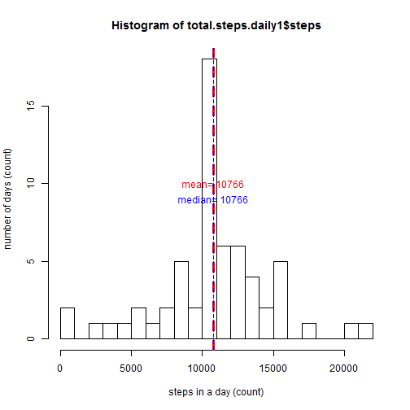

# Reproducible Research: Peer Assessment 1
## What is this?  
This assignment makes use of data from a personal activity monitoring device. This device collects data at 5 minute intervals through out the day. The data consists of two months of data from an anonymous individual collected during the months of October and November, 2012 and include the number of steps taken in 5 minute intervals each day.


## Loading and preprocessing the data
In this section, first it is checked if the file 'activity.csv' exists, if not, it will uzip the activity.zip in the current folder. Then, the 'interval' is modified into the format HH:MM:SS and converted into time object.


```r
        if(!file.exists('activity.csv')){
                unzip('activity.zip')
        }

        activity.data <- read.csv('activity.csv')
        activity.data$interval<- as.character(activity.data$interval)
        activity.data$interval<- ifelse(nchar(activity.data$interval)==1,
                                        paste('000',activity.data$interval, '00',sep = ''),
                                        activity.data$interval)
        activity.data$interval<- ifelse(nchar(activity.data$interval)==2, 
                                        paste('00',activity.data$interval, '00',sep = ''), 
                                        activity.data$interval)
        activity.data$interval<- ifelse(nchar(activity.data$interval)==3, 
                                        paste('0',activity.data$interval, '00',sep = ''),                                         activity.data$interval)
        activity.data$interval<- ifelse(nchar(activity.data$interval)==4,
                                        paste(activity.data$interval, '00',sep = ''), 
                                        activity.data$interval)
        activity.data$interval<- paste(
                substr(activity.data$interval, 1,2),':',
                substr(activity.data$interval, 3,4),':',
                substr(activity.data$interval, 5,6), sep='')
        activity.data$interval<- paste(activity.data$date, activity.data$interval)
        activity.data$interval<- ymd_hms(activity.data$interval)
        activity.data$date<- ymd(activity.data$date)
```
## What is mean total number of steps taken per day?

```r
        total.steps.daily<- activity.data %>%
                        group_by(date) %>%
                        summarise(steps=sum(steps, na.rm = T))
        total.steps.daily
```

```
## # A tibble: 61 x 2
##    date       steps
##    <date>     <int>
##  1 2012-10-01     0
##  2 2012-10-02   126
##  3 2012-10-03 11352
##  4 2012-10-04 12116
##  5 2012-10-05 13294
##  6 2012-10-06 15420
##  7 2012-10-07 11015
##  8 2012-10-08     0
##  9 2012-10-09 12811
## 10 2012-10-10  9900
## # ... with 51 more rows
```

1. Make a histogram of the total number of steps taken each day


```r
        hist(total.steps.daily$steps, 
             breaks = 20, 
             xlab='steps in a day (count)', 
             ylab='number of days (count)')
        abline(v=mean(total.steps.daily$steps), 
               col='red', lty=2)
        text(x=mean(total.steps.daily$steps), 
             y=10, 
             paste('mean=',floor(mean(total.steps.daily$steps))) , 
             col='red')
        abline(v=median(total.steps.daily$steps), 
               col='blue', 
               lty=2)
        text(x=median(total.steps.daily$steps),
             y=9,
             paste('median=',floor(median(total.steps.daily$steps))) ,
             col='blue')
```


2. Calculate and report the mean and median total number of steps taken per day.
The mean and median total number of steps taken per day is shown on the histogram.


```r
        steps.daily.median <- median(total.steps.daily$steps)
        steps.daily.mean <- mean(total.steps.daily$steps)
```

The **mean** is 9354 and the **median** is 10395.

## What is the average daily activity pattern?

```r
        activity.data$interval <- substr(as.character(activity.data$interval), 12, 19)
        int.steps.avg<- activity.data %>%
                group_by(interval) %>%
                summarise(int.avg=mean(steps, na.rm = T))
```

1. Make a time series plot

```r
        plot(x=strptime(int.steps.avg$interval, format = '%H:%M:%S'), 
             main='Average daily activity pattern',
             y=int.steps.avg$int.avg,type = 'l',
             xlab = 'Time of the day, 5-minute intervals, (HH:MM)',
             ylab = 'Average steps (count)')
        points(x=strptime(int.steps.avg$interval[which.max(int.steps.avg$int.avg)], format = '%H:%M:%S'), 
               y=int.steps.avg$int.avg[which.max(int.steps.avg$int.avg)], 
               col='red', 
               pch='X')
        text(x=strptime(int.steps.avg$interval[which.max(int.steps.avg$int.avg)], format = '%H:%M:%S'),
             y=int.steps.avg$int.avg[which.max(int.steps.avg$int.avg)], col='red',
             paste('time=',int.steps.avg$interval[which.max(int.steps.avg$int.avg)],
                   '\n', 
                   'avg steps=',
                   floor(int.steps.avg$int.avg[which.max(int.steps.avg$int.avg)])), pos = 1)
```


2.  Which 5-minute interval, on average across all the days in the dataset, contains the maximum number of steps?
The red cross showes the time and number of steps where on average across all the days in the dataset, contains the maximum number of steps. 
It is the 835 iterval containing an average of 206 steps.

## Imputing missing values
1. Calculate and report the total number of missing values in the dataset

```r
        not.complete.cases <-sum( !complete.cases(activity.data))        
        num.na <- sum(is.na(activity.data$steps))
```
There are 2304 missing values in the dataset.

2. Devise a strategy for filling in all of the missing values in the dataset.
The missing values are filled with the averages in the two-month period.

3. Create a new dataset that is equal to the original dataset but with the missing data filled in.

```r
        activity.data1<-activity.data
        for (i in 1: 17568) {
                if (is.na(activity.data1$steps[i])) {
                        activity.data1$steps[i] <- int.steps.avg$int.avg[ 
                                                which(int.steps.avg$interval==activity.data1$interval[i])] 
        
                }
        }
```


4. Make a histogram of the total number of steps taken each day.


```r
        total.steps.daily1<- activity.data1 %>%
                group_by(date) %>%
                summarise(steps=sum(steps, na.rm = T))
                
                
        hist(total.steps.daily1$steps, 
             breaks = 20, 
             xlab='steps in a day (count)', 
             ylab='number of days (count)')
        abline(v=mean(total.steps.daily1$steps), 
               col='red',
               lty=2,
               lwd=3)
        text(x=mean(total.steps.daily1$steps), 
             y=10, 
             paste('mean=',floor(mean(total.steps.daily1$steps))) , 
             col='red')
        abline(v=median(total.steps.daily1$steps), 
               col='blue', 
               lty=2)
        text(x=median(total.steps.daily1$steps),
             y=9,
             paste('median=',floor(median(total.steps.daily1$steps))) ,
             col='blue')
```



Calculate and report the mean and median total number of steps taken per day.

```r
        steps.daily.median1 <- median(total.steps.daily1$steps)
        steps.daily.mean1 <- mean(total.steps.daily1$steps)
```
As it can also be seen in the above plot,the mean is 10766 and the median is 10766.
Do these values differ from the estimates from the first part of the assignment? Yes!
What is the impact of imputing missing data on the estimates of the total daily number of steps?
as the missing values are filled, it affects both mean and median and as missing values are filled with the averages, the median shifts towards the mean.

##Are there differences in activity patterns between weekdays and weekends?
1. Create a new factor variable in the dataset with two levels -- "weekday" and "weekend" indicating whether a given date is a weekday or weekend day.


```r
activity.data1$days<- weekdays(activity.data$date)        
total.steps.daily1$days<- weekdays(total.steps.daily1$date)        
activity.data1$days<-ifelse(activity.data1$days=='Saturday' | activity.data1$days=='Sunday', 
       'Weekend', 
       'Weekday')
interval.rec<- read.csv('activity.csv')
interval.rec$interval->activity.data1$interval
head(activity.data1)
```

```
##       steps       date interval    days
## 1 1.7169811 2012-10-01        0 Weekday
## 2 0.3396226 2012-10-01        5 Weekday
## 3 0.1320755 2012-10-01       10 Weekday
## 4 0.1509434 2012-10-01       15 Weekday
## 5 0.0754717 2012-10-01       20 Weekday
## 6 2.0943396 2012-10-01       25 Weekday
```

```r
avg.steps.days<- activity.data1 %>%
        group_by(days, interval) %>%
        summarise(avg.steps=mean(steps))
```
2. Make a panel plot containing a time series plot (i.e. type = "l") of the 5-minute interval (x-axis) and the average number of steps taken, averaged across all weekday days or weekend days (y-axis).. 


```r
ggplot(data = avg.steps.days, 
       aes(x= interval, 
           y=avg.steps)) + 
        labs(x='Interval', y='Average steps', title='Average steps pattern over weekends and weedays')+
        geom_line()+
        facet_grid(rows = vars(days))
```


